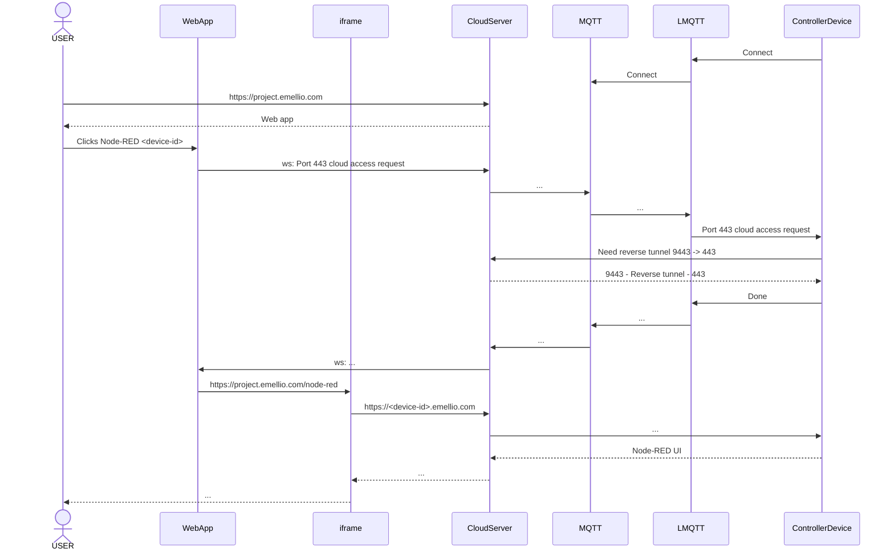

# Web access to Node-RED ControllerDevice behind firewall

Reverse SSH Tunnel gives cloud server HTTPS access to the ControllerDevice:

- On ControllerDevice: `ssh -R 9443:localhost:443 user@CloudSshServer:443`

Optional remote SSH access to ControllerDevice for other purposes:

- On ControllerDevice: `ssh -R 9022:localhost:22 user@CloudSshServer:443`

- On CloudSshServer: `ssh -p 9022 user@localhost`

Do the above from NodeJS (npm tunnel-ssh or ssh2) or Rust instead of bash. Use certificates for security.

To expose a local port on a remote machine (external interface) you need to enable the "GatewayPorts" option in your 'sshd_config'

```
# What ports, IPs and protocols we listen for
Port 22
Port 443
GatewayPorts yes
```

In Node-RED configuration, allow iframe embedding:

```javascript
httpAdminMiddleware: function(req, res, next) {
    // Set the X-Frame-Options header to allow the editor
    // to be embedded
    res.set('X-Frame-Options', 'allowall');
    next();
},
```

Embed the remote Node-RED UI in cloud web app (or open in separate tab):
```html
<iframe src="https://device-id.emellio.com" style="width: 1200px; height: 800px;"></iframe>
```

Log in via `HttpOnly` site cookie with JWT checked by Nginx on ControllerDevice:443.

Using the same cookie for other [subdomains should be possible](https://stackoverflow.com/questions/69483501/is-it-possible-to-set-an-httponly-cookie-from-one-domain-to-another-subdomain), but not tested.




# Example NodeJS app for normal SSH tunnel

```typescript
import tunnelSSH, { createTunnel } from 'tunnel-ssh';

const openRemoteTunnelSSH = async (host: string, username: string, password: string, srcPort: number, dstPort: number) => {
    const sshOptions = {
        host,
        port: 22,
        username,
        password
    };
    const openTunnel = async (sshOptions: any, srcPort: number, dstPort: number, autoClose = true) => {
        let forwardOptions = {
            srcAddr: '127.0.0.1',
            srcPort,
            dstAddr: '127.0.0.1',
            dstPort
        }
        let tunnelOptions = {
            autoClose
        }
        let serverOptions = {
            port: srcPort
        }
        let server: any
        let conn: any
        try {
            [server, conn] = await createTunnel(tunnelOptions, serverOptions, sshOptions, forwardOptions).catch(reason => {
                console.log(reason)
                return reason
            });
        } catch (e) {
            console.log(e)
        }
        return [server, conn]
    }
    while (true) {
        let server: any
        let conn: any
        try {
            [server, conn] = await openTunnel(sshOptions, srcPort, dstPort, false).catch(reason => {
                console.log(reason)
                return reason
            });

            server.on('connection', (connection: any) => {
                console.log(`New connection`);
            });
            while (true) {
                await new Promise(res => setTimeout(res, 1000))
            }
        } catch (e) {
            console.log(e)
            await new Promise(res => setTimeout(res, 10000))
        }
    }
}

const localPort = 10000
const remotePort = 10000
const remoteHost = '192.168.2.80'
const username = 'rapidreach'
const password = 'Ett&2tre'

try {
    openRemoteTunnelSSH(remoteHost, username, password, localPort, remotePort).catch(error => {
        console.log(error.message)
    })
    //openRemoteTunnelSSH(13389, 3389)
} catch (e) {
    console.log(e)
}

process.on('uncaughtException', error => {
    console.log(error.message)
    openRemoteTunnelSSH(remoteHost, username, password, localPort, remotePort).catch(error => {
        console.log(error.message)
    })
})
```

